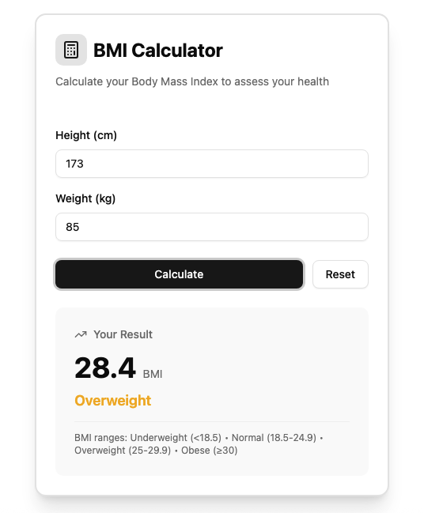

# 🧮 BMI Calculator

A sleek and responsive **Body Mass Index (BMI) Calculator** built with **Vue 3 + TypeScript**.  
It helps you quickly calculate your BMI and visualize your health category — all with a modern, elegant UI.

---

## ✨ Features

✅ **Real-time BMI Calculation** — instantly calculates your BMI based on height & weight.  
🎨 **Modern UI** — powered by [Tailwind CSS](https://tailwindcss.com) and [shadcn-vue](https://www.shadcn-vue.com/).  
📱 **Responsive Design** — works beautifully on mobile, tablet, and desktop.  
💡 **Clean Components** — modular structure with reusable form and result components.  
⚡ **Type-Safe** — built entirely with **Vue 3 + TypeScript**.

---

## 🧠 Tech Stack

| Category      | Tools / Libraries                                                    |
| ------------- | -------------------------------------------------------------------- |
| Framework     | [Vue 3](https://vuejs.org/)                                          |
| Language      | TypeScript                                                           |
| Styling       | [Tailwind CSS](https://tailwindcss.com)                              |
| UI Components | [shadcn-vue](https://www.shadcn-vue.com/)                            |
| Icons         | [Lucide Vue Next](https://lucide.dev/guide/packages/lucide-vue-next) |

---

## 🧩 Project Structure

```
src/
├── components/
│   ├── BmiCalculator.vue   # main container
│   ├── BmiForm.vue         # handles user input + actions
│   └── BmiResult.vue       # displays BMI results
└── App.vue                 # entry point
```

---

## 🚀 Getting Started

### 1️⃣ Clone the repo

```bash
git clone https://github.com/yourusername/bmi-calculator.git
cd bmi-calculator
```

### 2️⃣ Install dependencies

```bash
npm install
```

### 3️⃣ Run the development server

```bash
npm run dev
```

Then visit **http://localhost:5173** 🎉

---

## 🧮 How It Works

1. Enter your **height (cm)** and **weight (kg)**.
2. Click **Calculate**.
3. Instantly see your **BMI value** and category (e.g., Normal, Overweight).
4. Use **Reset** to start over.

---

## 🖼️ Preview



---

Built with ❤️ by **Codenathan**
